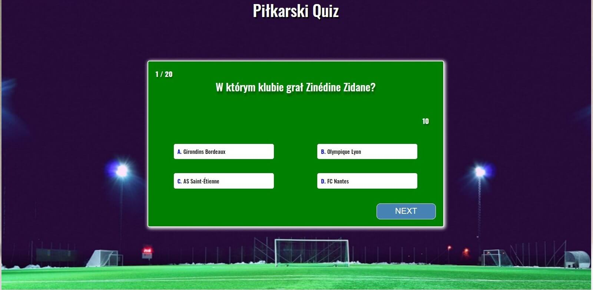

# football-quiz
Live demo: https://krzysiekk10.github.io/football-quiz/
 

## Opis / Description
Autorski pomysł - wykonany w ramach ćwiczeń. Za całą interakcję aplikacji odpowiada Java Script. 
Responsywnośc (breakpointy) ustawione na: 576px, 768px, 992px oraz 1200px - mobile first.

Football quiz that's my original idea - created as a part of the training project. Java Script is responsible for all application interaction. Breakpoints are set to: 576px, 768px, 992px and 1200px - mobile first.

## Zasady / Rules
Quiz składa się z 20 pytań, z ograniczeniem czasowym (15 sekund na każde pytanie). Jeżeli upłynie czas otrzymujemy 0 punktów za pytanie. Po kliknięciu odpowiedzi czas również się zatrzymuje i nie możemy już zmienić decyzji. W przypadku wybrania złej odpowiedzi pokazuje się poprawna odpowiedź (podświetlona na kolor zielony). Za każdą poprawną odpowiedź przydzielony jest 1 punkt.  Maksymalna liczba punktów to: 20.

The quiz consists of 20 questions, with a time limit (15 seconds for each question). If the time runs out you will get 0 points for the question. After clicking the answer time stops and you can not change your decision. If you make a mistake, the correct answer will be highlighted (in green). Correct answer is a one point. You can get 20 points maximum.

## Technologie / Technologies
JAVA SCRIPT, HTML5 i CSS3 (SCSS)

